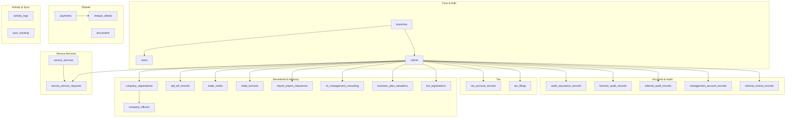

# AATS Database Design Reference

> **Version**: 1.0.0 | **Database**: PostgreSQL 15+ | **Date**: 2026-03-21

## Schema Overview — 24 Tables across 8 Domains



## Table Summary

| # | Table | Domain | Key Fields |
|---|---|---|---|
| 1 | `branches` | Core | name, code (South/West/Central/Northeast) |
| 2 | `users` | Core | username, email, role, branch, password_hash |
| 3 | `clients` | Core | client_code, name, category, status, branch, revenue |
| 4 | `audit_assurance_records` | Audit | client, branch, payment_status, process |
| 5 | `forensic_audit_records` | Audit | + period_number, period_type |
| 6 | `internal_audit_records` | Audit | + period_number, period_type |
| 7 | `management_account_records` | Audit | + payment_option, source docs via `documents` |
| 8 | `internal_control_records` | Audit | + billing (sub_total, discount, total), period |
| 9 | `tax_account_records` | Tax | + assigned_to, billing, process stages |
| 10 | `tax_filings` | Tax | tax_type (CIT/IIT/VAT/SSCL/WHT), period, amounts |
| 11 | `company_registrations` | Secretarial | company_name, type, TIN, process |
| 12 | `company_officers` | Secretarial | name, position, officer_type |
| 13 | `epf_etf_records` | Secretarial | company_name, number_of_staff |
| 14 | `trade_marks` | Secretarial | trademark_code, status |
| 15 | `trade_licenses` | Secretarial | license_code, assignment |
| 16 | `import_export_clearances` | Secretarial | clearance_code, tin_number |
| 17 | `hr_management_consulting` | Secretarial | assignment, status |
| 18 | `business_plan_valuations` | Secretarial | assignment, status |
| 19 | `boi_registrations` | Secretarial | country, investment_value_usd |
| 20 | `nexora_services` | Nexora | name (lookup: 7 service types) |
| 21 | `nexora_service_requests` | Nexora | service_id, status, notes |
| 22 | `payments` | Shared | polymorphic (record_type + record_id), amounts |
| 23 | `cheque_details` | Shared | bank, cheque_number, status |
| 24 | `documents` | Files | polymorphic, storage_key (→ Cloudflare R2) |
| 25 | `activity_logs` | Activity | user, action, module, description |
| 26 | `sync_tracking` | Sync | table_name, operation, device_id |

## Sync Compatibility (Dotmim.Sync)

All synced tables include:
- `created_at TIMESTAMPTZ DEFAULT NOW()`
- `updated_at TIMESTAMPTZ DEFAULT NOW()` (auto-managed via trigger)
- `is_deleted BOOLEAN DEFAULT FALSE` (soft-delete pattern)

## File Storage Strategy

The `documents` table stores metadata only. Actual files are stored in **Cloudflare R2** and linked via the `storage_key` column.

## Deployment

```bash
# Apply schema to a fresh PostgreSQL database
psql -U your_user -d aats_db -f database/schema.sql
```
